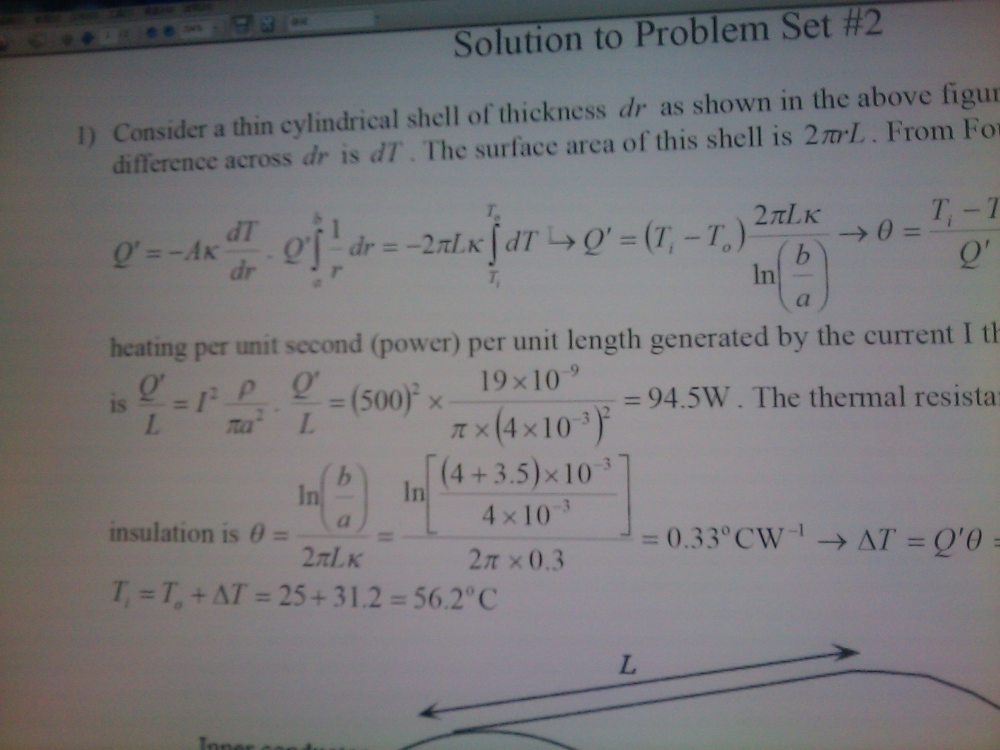
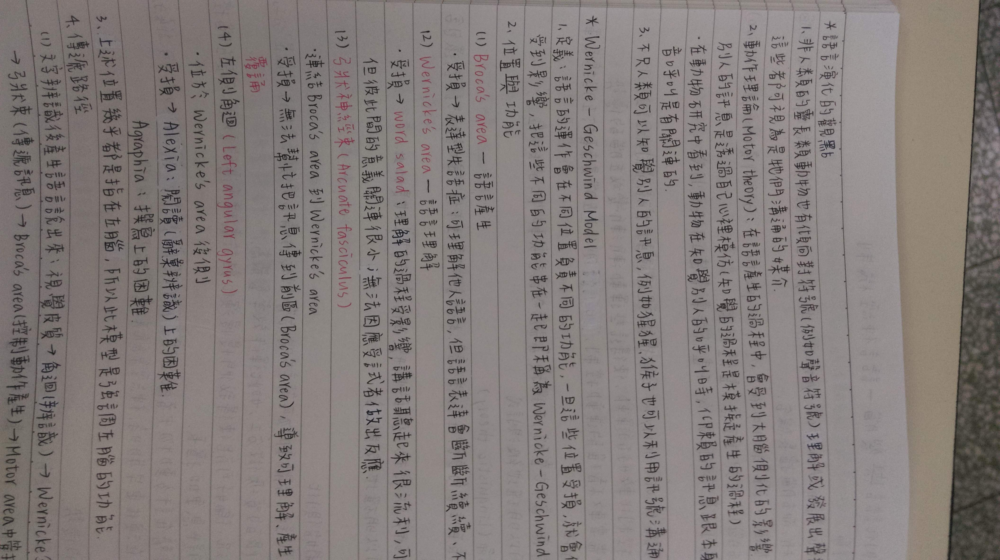
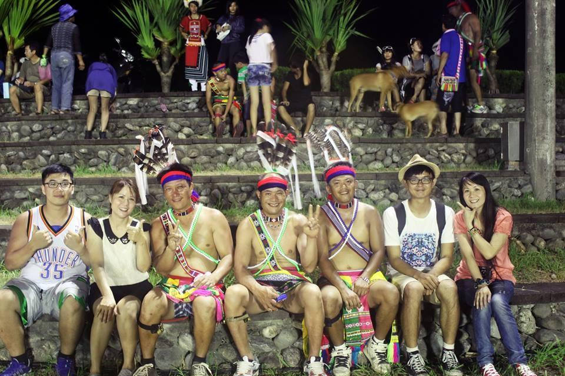
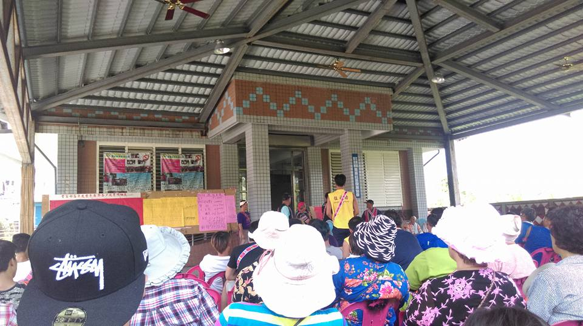
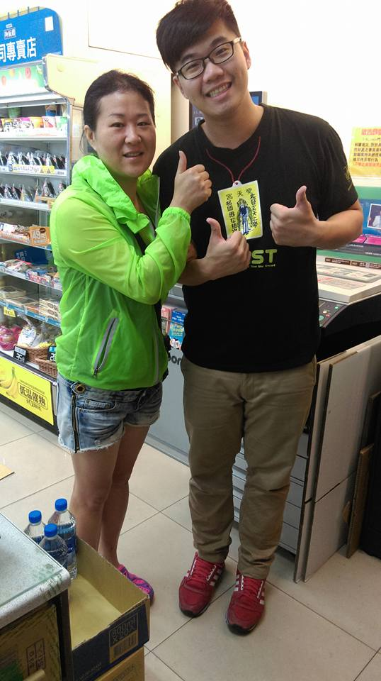
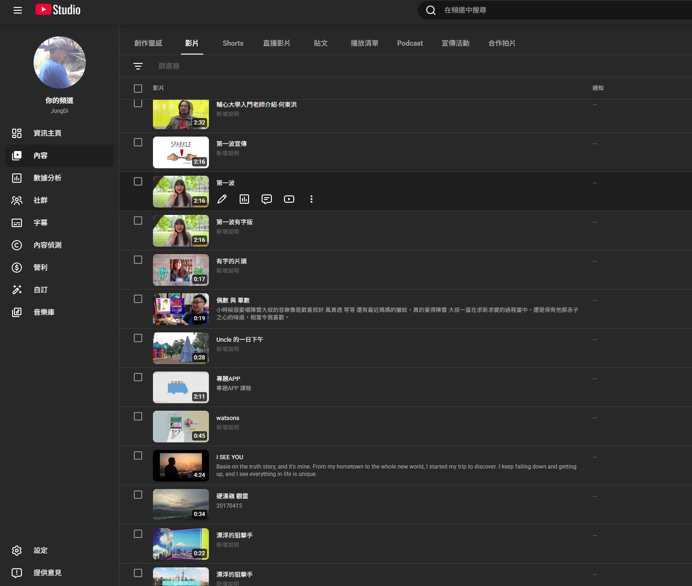
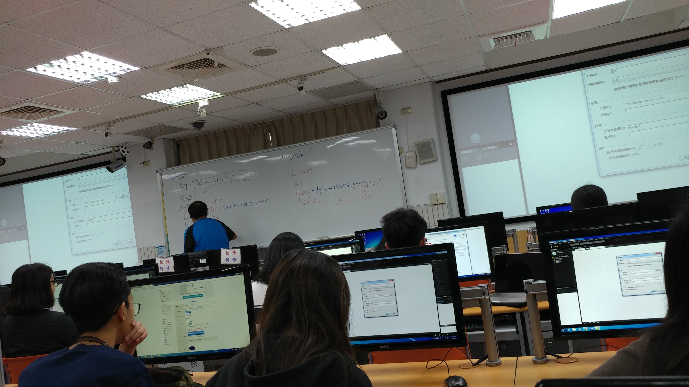
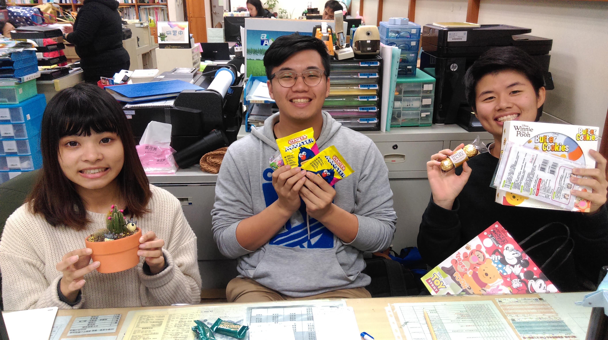
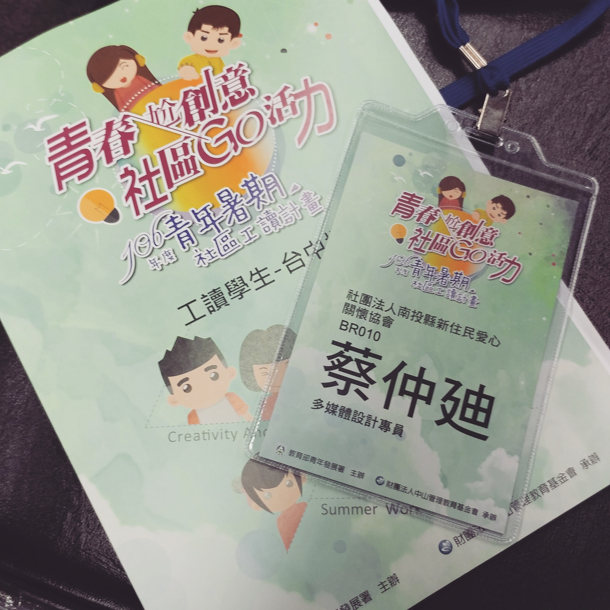

  

    <h1 class="font-bold leading-tight">在脫軌處扎根</h1>
    <h2 class="font-700 leading-tight">IT'S NOT A BUG , IT'S A FEATURE</h2>
    

      

      🎓 職涯分享        
        <h2 class="!mt-1 text-2xl font-black text-gray-800">蔡仲迪</h2>
        

          綠易股份有限公司
          |
          GHG 技術二部 部門主管
        

      

    

    

      

        
💡 人生的軌道，從來不是筆直的。

        
🌱 我們都會懷疑、迷惘、跌倒，甚至覺得自己脫離了正軌。

        
🌳 但也正是在那些偏離的時刻，種下了改變的種子。

        
🚀 每一次脫軌，都可能是重新扎根的開始。

      

    

  

  

    
  

<!--
嗨大家好我是仲廸，你們可以叫我茱弟或者Jung，我是你們畢業好一陣子的學長。
目前在綠易股份有限公司 | GHG 技術二部 擔任部門主管。

那很開心今天可以回來和大家分享我職涯。

在開始之前，我想說
有些事情當下看起來像人生的 Bug，像是科系的選擇、成長的迷惘、轉職的挑戰。
但回頭看，它可能反而是你最獨特的 Feature。
-->

---
transition: fade-out
layout: image-right
image: ./A_SUN.jpg
---

# 從《陽光普照》開始：我們如何被期待推著走

<v-clicks>

- **志願填寫** - 你為什麼會選擇心理學系 ?
- **畢業之後要做什麼** - 是諮商師、輔導老師、人資 ?

- **不要被既有的框架限制住，可以嘗試從期待裡脫軌。**

</v-clicks>

<!--
講座的開始，我想先講一部電影，這部電影叫做《陽光普照》。

《陽光普照》裡讓我很有感的地方，是一個人如何活在家庭期待裡。有些人被期待優秀、穩定、懂事、不要出錯。要成為大家心中那個應該會成為「成功的孩子」。

這些其待其實會是一種隱形的框架。

這時候我我想要問你們，你們也有嗎?

譬如說: 志願的填寫，你為什麼會選擇念心理學系阿 ?

是因為其他科系都聽起來沒那麼酷嗎。
還是因為你想了解自己。可能有人對你說過，我覺得你很好聊天，或你很能夠同理我，所以你自己就會覺得說，我好像可以當助人工作者。

又或是因為看了電影像是心靈捕手、三個傻瓜很感動，想說我也想成為那樣子的人。有人是嗎?

這個問題可能會跟著你們到畢業。
當你們越來越靠近就業市場的時候，問題可能就會變成
阿你畢業之後要做什麼 ?
是要當諮商師嗎 ? 還是輔導老師 ? 

我希望你在未來面臨求職的時候，第一個冒出來的想法不要是
1. 心理系畢業可以做什麼工作。

而是
1. 我畢業之後想做什麼

不要被既有的框架限制住，
可以嘗試從期待裡脫軌。

大一的你們，也許現在還不用急著回答你們未來要做什麼。
但可以開始理解：你是怎麼被期待推著走，又怎麼慢慢找回自己的選擇。
-->

---
transition: slide-left
---

# Bug #1 人生脫軌 Severity: Critical

  

  
    
    
    
    = 5"
      src="./public/TUTOR.jpg"
      alt="家教"
      class="absolute inset-0 h-full w-full object-cover"
    />
  

  

    

      <strong>電子工程學系</strong>
       - (肄業)
    

    <v-clicks>
      
<strong>懷疑、迷惘、漂泊</strong>

      

        
      

      
<strong>中斷不是答案，而是問題的開始</strong>

      
<strong>遇到的挫折與問題可能跟環境、期待、策略、支持系統有關</strong>

    </v-clicks>
  

<!--
這是我的第一次脫軌

我以前認為人生應該要這樣：選一個看起來有前途的科系，好好讀完，找一份穩定工作。

我原本念電子工程，唸到大二的暑假就被退學了。
被退學不是一件浪漫的事。超級痛、超級丟臉，也不知道怎麼面對家人、同學，甚至不知道怎麼面對自己。

我記得那時候家庭關係是非常撕裂的。
我不曾看到我那超級Tough的老爸哭過，那是唯一一次。
當退學通知書寄到家裡來的那一天，就像是被判刑定讞一樣。
我哭著跟我爸我媽道歉，然後跟他們說接下來我會自己一個人負責。

之後我跑去工地工作，然後跑到台中的餐廳、超商打工，也當過一陣子的家教，大概半年的期間我都沒和家裡聯絡。

直到有一天，我爸打給我，那時候我還在猶豫要不要把電話接起來，因為我覺得我根本沒有臉接電話。
但最後我還是接起來了，電話一開頭，我聽著爸帶著一點酒醉的聲音說
:「弟弟」你很久沒有沒有回家了捏，爸爸很想你。也正是因為那一天的電話，把我接住了。我也沒想過我那Tough的老爸，會說出溫暖的話。

從我的脫軌到從與父親關係的轉變
我開始對於自己身上的議題感到興趣。

也是我會想念心理學系的開始。

我想要和跟我有想同處境的人對話。我想了解自己身上的議題

有些中斷不是答案，而是問題的開始。

我開始解構: 遇到的挫折與問題可能跟環境、期待、策略、支持系統有關
-->

---
transition: slide-up
---

# Feature #1 轉換科系

    

      
兩次的轉學考

      <v-clicks>
        
說與分享的改變

        
人與人的連結

      </v-clicks>
      
<strong>不是所有的問題都能在當下得到解答</strong>

    

  

    
    
    
    
    = 4"
      src="./public/LIN_MAMA.jpg"
      alt="林媽媽"
      class="absolute inset-0 h-full w-full object-contain"
    />
  

<!--
第一次的脫軌之後，我對於我自己開始有了一些想像，我開始準備了轉學考。

第一次的結果是沒考上。因為沒有在學的身分，接受到兵單的我得去當兵了。

退伍之後我面臨了第一個現實問題，我已經21歲了，如果這次再考不上，怎麼辦 ?

我還要再繼續念書嗎 ? 我其實根本就沒有答案。

那個時候，我只能等待第二次轉學考結果的到來。

在第二次準備轉學考的過程當中，我回到了入伍當兵前的超商繼續工作，跟客人們也越來越熟，我也開始願意分享自己正在準備心理學系的轉學考，當然還有我的徬徨。

但也或許也正是我開始願意述說，我遇到了許多改變了我人生中的貴人，譬如說畫面上(左2)的小珠姊。

在等待第二次的轉學考結果。有幾個特別關心我的客人給了我好多的支持跟幫忙。

那時候，小珠姊問我要不要去她的部落走走，這張圖片是在花蓮縣豐濱鄉的聚會所「頂阿陋」，印象最深刻的是我們我和身邊的部落朋友們手牽手閉眼睛一起禱告，禱告結束之後我們席地而坐一起吃飯，旁邊的一位部落阿嬤問我是誰，這時候小珠姊說我是他的娃娃。這時候我震驚也很感動的，對於我來說我是一個外來的人，但小珠姊卻說我是她的娃娃，那時候在部落的我感受到了真誠真實的人與人的連結與支持。

還有一位董姊，那時候跟我說，如果你沒考上的話，如果想學一技之長，可以和她說，她在彰化有開一間新的日式料理店，可以在她老公旁邊學習，或許在沒考上心理學系之後，我現在會是日本料理師傅。

還有最後在我考上之後，祝賀給我紅包的林媽媽。

我想和大家說的是，不是所有的問題都能在當下得到解答。在你帶著問題的過程當中，也許許多的疑問也會變得越來越熟悉、清楚。
-->

---
transition: slide-left
---

# 興趣與職能探索

  

  
  
  
  
  = 4"
    src="./public/EXPLOER_2.jpeg"
    alt="暑期工讀"
    class="absolute inset-0 h-full w-full object-cover"
  />
  

  

    
影片剪輯

    <v-clicks>
      
網頁設計-通識課

      
學生輔導中心-工讀生

      
青年發展署-社區工讀

      
      
<strong>不排斥，那就接觸吧!</strong>

      
<strong>興趣不一定一開始就是職涯。
但當它能解決問題、創造產出、幫助你連結機會，它就會慢慢長成職能。</strong>

    </v-clicks>
  

<!--
回頭看我的大學生活，我覺得很多後來派上用場的能力，一開始都不是用職涯規劃的方式出現的。

它們一開始可能只是興趣、只是好奇、只是覺得不排斥。
所以我就想說，那就接觸看看吧。

例如影片剪輯，是我大學時期的一個興趣。
一開始它可能只是覺得好玩，想把素材整理成一個故事，想讓畫面、聲音和節奏搭起來。

但後來我發現，影片剪輯不只是會操作軟體。
它也包含怎麼整理素材、怎麼安排敘事、怎麼讓觀眾看懂重點。

更有趣的是，後來我能夠面試上青年發展署的社區工讀，影片剪輯就是一個很重要的原因。
那時候我才發現，原來你以為只是興趣的東西，有時候會在某個機會裡，突然變成你的優勢。

我也修過網頁設計的通識課。
那時候它看起來不是主線，只是一門課。
但它讓我重新接觸技術，也讓我發現，原來技術可以變成看得見、摸得到的畫面。

我可以透過 HTML、CSS，把內容放到網路上。
可以調整版面，可以做出互動，可以把一個想法變成使用者看得見的東西。

對後來的我來說，這其實是走向前端工程很早期的線索。

另外，我也在學生輔導中心當過工讀生。
這讓心理學不只是課本裡的理論，而是讓我真的看見人會有壓力、會迷惘、會需要支持，也會需要被理解。

這些經驗當下看起來可能很零散。
影片剪輯、網頁設計、學生輔導中心、青年發展署社區工讀，好像不是同一條線。

但回頭看，它們其實慢慢接起來了。

影片剪輯讓我練習用畫面說故事。
網頁設計讓我重新接觸技術。
學生輔導中心讓我更理解人。
青年發展署的社區工讀，讓我看見興趣也可以變成一種可以貢獻的能力。

所以我想跟你們說，不是每一件事都要等到你非常熱愛、非常確定，才可以開始。
有時候，不排斥，就可以先接觸看看。

你要先接觸，才知道自己喜不喜歡。
你要先試過，才知道自己適不適合。
你要先累積，才知道這些經驗未來會怎麼接起來。

興趣不一定一開始就是職涯。
但當它能解決問題、創造產出、幫助你連結機會，它就會慢慢長成職能。

因為很多學生會覺得：

我的興趣好像沒有用。
我的經驗很零散。
我不知道這些東西能不能放進履歷。

但其實，興趣只要累積到能夠解決問題、創造產出、服務某個需求，它就有機會變成職能。

不排斥，那就接觸吧。

不是每一件事都要等到你非常熱愛，才可以開始。

很多方向，一開始不是熱愛，而是不排斥。
不是使命感，而是好奇。
不是人生目標，而是「好像可以試試看」。

這就夠了。

你可以因為不排斥，去修一門課。
因為有點好奇，去參加一個活動。
因為剛好有機會，去申請一份工讀。
因為想試試看，去學一個工具。

很多職涯線索，就是這樣慢慢累積出來的。

興趣、經驗、職能，不是一開始就分得很清楚

大一的時候，我們很容易把事情分成幾類：

這是興趣。
這是課業。
這是打工。
這是職涯。
這是未來有用的。
這是未來沒用的。

但其實，很多能力一開始不會這麼清楚。

影片剪輯一開始是興趣，後來變成面試青年發展署社區工讀的優勢。
網頁設計一開始是通識課，後來變成我走向前端工程的入口。
學生輔導中心一開始是工讀經驗，後來變成我理解人、理解支持系統的一部分。

這些經驗當下看起來可能很零散。

但回頭看，它們其實都在指向某些線索：

我喜歡整理資訊。
我喜歡用畫面溝通。
我對人有興趣。
我願意接觸技術。
我可以把創作、心理和工程慢慢接起來。

給大一學生的提醒

所以如果你現在是大一，我會建議你不要太急著問：

這個東西以後到底有沒有用？

你可以先問：

我排斥嗎？
我有一點好奇嗎？
我願意試一次嗎？
這件事會不會讓我多認識一點自己？
它能不能讓我多累積一個經驗、一個作品、一個故事？

很多時候，你要先接觸，才知道自己喜不喜歡。
你要先試過，才知道自己適不適合。
你要先累積，才知道這些東西未來會怎麼接起來。

不是所有嘗試都會變成職涯。
但很多職涯，都是從一個小小的嘗試開始的。

影片剪輯
從興趣開始，後來成為面試青年發展署社區工讀的優勢。
網頁設計｜通識課
一門看似支線的課，成為重新接觸技術與前端工程的入口。
學生輔導中心｜工讀生
讓心理學不只停在課本，而是看見人的壓力、支持與需求。
青年發展署｜社區工讀
興趣累積成具體能力，能力又連結到新的機會。
不排斥，那就接觸吧
很多職涯線索，不是一開始就想清楚，而是在嘗試中慢慢浮現。
-->

---
transition: slide-left
layout: image-right
image: ./ZEN_AN_2.jpg
---

# Bug #2 畢業之後的第一份工作

- **工作適應** - 募款、輔導、工作媒合、愛心餐、住宿。
從學生到工作者，不只是身份改變，而是責任、節奏與角色的改變。
<v-clicks>

- **漫長的工時** - 有意義的工作也會累。
熱情不能取代界線，責任感也不能變成無限燃燒自己的理由。

- **獨立作業** - 獨立不代表不需要援助。
真正成熟的獨立，是知道什麼可以自己處理，什麼需要找資源一起處理。

- **職涯資料** - 獨立不代表不需要援助。
第一份工作不一定給你答案，但會讓你更理解自己的限制、需要與工作條件。

</v-clicks>

<!--
如果說被退學是我人生裡第一個很大的 bug，那畢業後的第一份工作，對我來說就是 Bug #2。

畢業之後，我進入第一份工作。工作接觸的事情很多，有募款、輔導、工作媒合、愛心餐，也有住宿相關的協助。

這些事情聽起來都很有意義。
但真正進到現場之後，我才知道，有意義的工作不代表不會累。

因為你面對的不只是工作項目，而是真實的人、真實的需求、真實的限制。
有人需要吃飯，有人需要住的地方，有人需要工作機會，有人需要陪伴和協助。

那時候我開始理解，從學生變成工作者，不只是換一個身份。
它是一整套生活節奏、責任感、人際關係與自我定位的改變。

第一份工作裡，漫長的工時也讓我印象很深。
剛開始工作時，我們很容易覺得自己應該要多做一點，要證明自己可以，不能讓人覺得不負責任。

尤其當工作跟助人、服務有關時，這種壓力會更強。
因為你會覺得你面對的是人的需要，所以很容易把責任無限放大。

可是後來我慢慢理解，熱情不能取代界線，責任感也不能變成無限燃燒自己的理由。

如果一份工作長期需要你犧牲健康、生活和情緒穩定，那就不能只把它解讀成「我還不夠努力」。
你也要問，這個工作設計合理嗎？這個負荷是短期狀況，還是長期常態？我有沒有可以求助的人？

另外，那份工作也有很多獨立作業的時候。
獨立作業表面上聽起來很自由，但對剛畢業的人來說，有時候也意味著孤單。

因為你會遇到很多不知道怎麼判斷的狀況。
這個個案要怎麼協助？這個資源要去哪裡找？這個界線要怎麼拿捏？我現在是應該再多做一點，還是應該停下來？

那時候我開始理解，獨立不代表不需要援助。
會求助其實也是一種能力。

真正成熟的獨立，不是什麼都自己扛，而是知道哪些事情我可以自己處理，哪些事情我需要找資源一起處理。

回頭看，第一份工作沒有直接給我人生的標準答案。
但它給了我很多資料。

它讓我知道，我在什麼樣的工作裡會有意義感，也讓我知道，我在什麼樣的環境裡會被消耗。
它讓我理解助人工作裡的責任，也讓我理解界線和支持系統的重要。

所以我把它稱為 Bug #2，不是因為那段經驗不好，而是因為它像一個新的錯誤訊息，提醒我需要重新理解工作、責任、孤單、援助和自己能長期發揮的環境。

第一份工作不一定會給你答案。
但它會讓你更理解自己。
-->

---
transition: slide-up
layout: image-left
image: ./DIIGGING.jpg
---

# 休息與沉澱

- **農工** - 身體在工作，腦袋也在整理。
<v-clicks>

- **休息不是逃避** - 有時候停下來，不是放棄，而是重新理解上一段經驗。

- **未來** - 我開始問自己：下一步要去哪裡？什麼工作能讓我長期累積？

- **家庭的支柱** - 職涯不是只有夢想，也有收入、穩定與家庭責任。

- **重新選擇** - 我需要的不只是下一份工作，而是一條能累積能力與選擇權的路。

</v-clicks>

<!--
Bug #2 之後，我跑去做農工。
比較具體地說，就是去除草。

這件事聽起來好像跟職涯很遠。
它不像履歷上漂亮的經歷，也不像一個清楚的職涯規劃。

但對那時候的我來說，那段時間很重要。
因為我剛經歷完第一份工作的適應、漫長工時、獨立作業，以及那種孤單又需要援助的狀態。
我需要先離開那個節奏，讓自己慢下來。

除草是一種很直接的工作。
草在那裡，你就去除。
太陽在那裡，你就流汗。
身體會累，但事情很具體。

那段時間，我一邊工作，一邊想很多事情。
我想我的未來。
想我接下來到底要做什麼。
想我是不是要繼續留在原本的助人相關領域。
也想我家裡的經濟狀況。

因為職涯不是只有「我喜歡什麼」而已。
職涯也常常牽涉到很現實的問題：我需要收入，我需要穩定，我需要照顧自己，也可能需要照顧家裡。

那時候我開始意識到，我不能只問自己喜歡什麼。
我也要問自己，能不能成為家庭比較穩定的支柱。

這不是一件輕鬆的事。
因為當你開始把家庭責任放進職涯選擇裡，很多選項就不只是喜不喜歡而已。

我開始想，哪個領域有比較好的收入成長？什麼能力可以長期累積？什麼工作不只是現在可以做，也能讓我未來更有選擇？

所以那段農工經驗，表面上好像不是職涯主線。
但它其實讓我重新面對很現實的人生問題。

我不是只需要下一份工作。
我需要的是一條能慢慢累積能力、累積收入、累積選擇權的路。

所以休息不一定是逃避。
有時候停下來，是為了從上一段消耗裡退一步，重新看見自己接下來真正要往哪裡走。
-->

---
transition: fade-out
layout: image-right
image: ./III.jpg
---

# Feature #2 職業轉換

- **資策會(財團法人資訊工業策進會)**
<v-clicks>

- **工作特性** - 遠端辦公

- **資源限制** - 電腦

- **跨國的工作機會**

- **更多的收入**

</v-clicks>

<!--
農工那段沉澱之後，我開始更務實地思考自己的下一步。

我想的不只是我喜歡什麼。
我也開始問自己，什麼能力可以長期累積？什麼工作有比較好的收入成長？什麼職業可以讓我未來有更多選擇？如果我想成為家裡比較穩定的支柱，我需要培養什麼能力？

後來，我跑去資策會上課。

這對我來說，是一個很重要的職業轉換。
它不是單純去學程式而已。
它更像是我把前面那些迷惘、挫折、現實壓力和未來想像，整理成一個具體行動。

其實我大學時已經接觸過一些線索。
我做過影片剪輯，也修過網頁設計通識課。
我知道自己不排斥技術，也對畫面、資訊整理、使用者理解有興趣。

但到了資策會，這些線索開始變得更清楚。
它不再只是「我好像對網頁有興趣」，而是「我能不能把這個興趣，訓練成可以進入職場的能力」。

軟體工作吸引我的地方之一，是它讓我看到遠端辦公和跨國工作的可能。
如果你的能力可以透過網路交付，如果你的產出可以透過程式碼、系統和協作工具被看見，那工作就不一定完全被地點限制。

這對當時的我來說很重要。
因為我想要的不只是下一份工作，而是一條能逐漸增加選擇權的路。

當然，轉職不是只有想像，也有很現實的資源限制。
例如你需要一台可以練習的電腦，需要時間，需要工具，也需要一個能讓你持續學習的環境。

所以轉職不是一句努力就好。
努力很重要，但努力也需要條件。

另外，我也很誠實地面對收入這件事。
談職涯時，很多人會不好意思談錢，好像一談錢就不夠理想。
但對我來說，收入不是只為了錢。
它也是責任。

如果我想照顧自己，也想成為家裡比較穩定的支柱，那我就需要一個有成長性、能累積專業，也能提高收入的方向。

所以我把這段稱為 Feature #2。
因為它是我在經歷 Bug #2 之後，開始長出來的一個新功能。

第一份工作讓我看見工作需要支持、界線與可持續性。
農工那段時間讓我看見未來與家庭責任。
而資策會讓我開始把這些問題轉成行動。

那我就去學。
那我就重新訓練。
那我就把興趣變成能力，把能力變成職業，把焦慮變成行動。
-->

---
transition: fade-out
layout: image-right
image: ./III.jpg
---

# 轉職不是浪漫故事

- **非資工系畢業** - 不是標準路徑，會有基礎差距，也會有身份焦慮。

<v-clicks>

- **專業知識不足** - 熱情不能跳過基礎。
做得出來只是第一步，做得穩、可維護、可協作，才是職業能力。

- **加班地獄** - 轉職成功不是故事結尾，而是另一段高壓學習的開始。

- **職涯不是一次選對，而是持續校準** - 走一段、看見問題、補能力、再調整方向。

</v-clicks>

<!--
多人後來聽到我從心理系轉到前端工程，可能會覺得這是一個很漂亮的故事。

好像是原本迷惘，後來找到方向，去資策會上課，成功轉職工程師，後來還成為主管。

但我想很誠實地說，轉職不是浪漫故事。

它不是突然找到熱情，然後人生就一路順利。
它更像是你把自己丟進一個新的系統裡，重新學語言、重新補基礎、重新證明自己，也重新面對很多自我懷疑。

我不是資工系畢業。
所以剛開始進入工程領域時，我很清楚知道自己不是標準路徑出來的人。

別人可能大學四年就在學資料結構、演算法、作業系統、網路、資料庫。
但我必須用比較密集、比較實作、比較邊做邊補的方式切進來。

這不是不好，但你會知道自己有很多缺口。
有些東西沒學過，有些基礎不穩，有些名詞聽得懂一半。

所以轉職最難的地方不只是學技術，還有一種心理壓力：
我是不是不夠正統？我是不是比別人晚太多？我是不是永遠補不完？

進到工作現場之後，這種感覺會更明顯。
前端不是只會寫畫面就好。你會遇到 JavaScript、TypeScript、框架、狀態管理、API、Git、部署、測試、效能、資安，後來還會遇到架構和維護性。

一開始你可能以為，做得出來就好了。
但後來才知道，做得出來只是第一步。
做得穩、做得可維護、做得讓別人接得下去，才是職業能力。

而且轉職成功不代表從此幸福。
我也遇過加班地獄。
趕專案、需求變動、技術不熟、時程壓力，一邊工作一邊補自己不會的東西。

那種感覺很像白天在工作裡被追著跑，晚上還要補自己的基礎。
工作要交付，能力要補齊，不能一直犯錯，也不能拖累團隊。

所以轉職不是很浪漫。
它很常是狼狽的、疲憊的、焦慮的。

但我後來也慢慢理解，轉職不是跳過痛苦，而是換一種痛苦。
原本的工作有原本的辛苦，轉職後也有新的辛苦。

真正要問的不是哪條路完全不痛，而是哪一種辛苦是我願意承擔的？哪一種痛苦會讓我長出能力？哪一種累可以累積成未來的選擇權？

所以我越來越相信，職涯不是一次選對，而是持續校準。

我從電子工程被退學，到心理系，到第一份工作，到農工沉澱，再到資策會轉職，最後成為前端工程師。
這中間沒有哪一步是一次選對。

更多時候是，我走了一段，發現不對，停下來，重新整理，補一些能力，再往下一步走。

職涯比較像導航，不像考試。
考試要你選出正確答案，但導航是你要不斷校正位置。

所以轉職不是浪漫故事。
它是一段承認不足、補上基礎、承擔壓力，並在一次次校準中，重新長出專業身份的過程。
-->

---
transition: slide-left
---

# Debug：錯誤訊息不是結束，是線索

- **Bug** - 只要是人，就不可能沒有 Bug

- **Side Effects** - 你的選擇，常常會影響你沒想到的地方

- **Error Message** - 錯誤訊息不是判決，是提示

- **Breakpoint** - 停下來，不是放棄，是為了看清楚

- **Refactor** - 不是全部重來，而是重新整理

<!--
工程師每天都在跟 bug 相處。
所以後來我慢慢覺得，人生其實也很像一段程式。

只要是人，就不可能寫出沒有 bug 的人生。
我們一定會選錯、會卡住、會失敗、會遇到看不懂的錯誤訊息。

以前我被退學的時候，我覺得那是一個很大的 error message。
它好像在告訴我：你不適合、你失敗了、你比別人落後了。

但後來我成為工程師之後，我開始用另一種方式理解這件事。
error message 不是結束，它是線索。
它不是叫你放棄整個程式，而是提醒你要去看：到底是哪一段邏輯出了問題。

也許不是我整個人壞掉了。
也許是我當時的學習方法不適合。
也許是我沒有想清楚自己為什麼要走那條路。
也許是我一直活在別人的期待裡，卻沒有真正問過自己想要什麼。

所以 debug 對我來說，不只是工程能力，也是一種人生能力。
它讓我學會不要急著否定自己，而是回頭看那些錯誤訊息背後，到底藏著什麼線索。

人生有 bug，不代表你壞掉了。
有時候，它只是提醒你：這裡需要重新理解，這裡需要重新選擇，這裡需要重新設計。

所以 debug 對我來說，不只是工程能力，也是一種人生能力。
它讓我學會不要急著否定自己，而是回頭看那些錯誤訊息背後，到底藏著什麼線索。

我們寫程式的時候，一定會遇到 bug。

工程師在面對錯誤時，不會只是看著錯誤訊息說：「完蛋了，程式壞了。」
我們會做一件事，叫做 debug。

debug 的意思不是否定整個程式，而是開始追問：

錯在哪裡？
是哪一段邏輯出了問題？
是資料錯了？
是環境不對？
是我對需求理解錯了？
還是這段程式原本就不適合這個場景？

人生也是一樣。
bug 不是例外，bug 是日常。

你越是寫複雜的程式，越有可能出現 bug。
你越是做重要的選擇，越有可能遇到混亂、失誤、卡住、不確定。

所以人生有 bug，不代表你很爛。
它只是代表你正在寫一段夠複雜的程式。

我以前被退學的時候，很容易把那件事情解讀成：

我不夠好。
我是不是人生失敗了？

但後來我發現，也許問題不只是「我這個人有問題」。
可能是我的學習方法不對。
可能是我當時不知道自己為什麼要讀。
可能是我沒有足夠的支持系統。
可能是我只是被推著走進一條路，卻還沒有真正理解自己想要什麼。

bug 不一定代表整個系統要報廢。
有時候它只是提醒你：

某一段邏輯，需要重構。

在程式裡，side effect 是什麼？

簡單說，就是你原本只想改 A，結果 B、C、D 也被影響了。

人生也是這樣。

你以為被退學只是一個學籍狀態的改變，
但它帶來的 side effects 可能很多：

你開始懷疑自己的能力。
你不知道怎麼面對家人。
你害怕同學怎麼看你。
你對未來失去方向。
你開始覺得自己是不是比別人落後。

這些 side effects 很真實。
有時候真正痛的不是事件本身，而是事件帶出來的一連串影響。

可是 side effects 不一定都是壞的。

後來我轉到心理系，這件事也產生了新的 side effects：

我開始更理解人的壓力與動機。
我開始學會觀察自己。
我開始重新理解失敗不是單純的能力問題。
我開始知道，人的選擇會受家庭、環境、期待、資源影響。
我後來成為前端工程師時，也更能理解使用者、產品與團隊。

當時看起來是脫軌，
後來卻變成我職涯裡很重要的養分。

所以 side effect 這件事提醒我：

一個選擇不只會帶來結果，也會帶來連自己都沒預期到的改變。
有些改變當下很痛，但長遠來看，可能會成為你的一部分能力。

寫程式時，error message 通常很討厭。

它可能很長、很紅、很難懂，
甚至有時候你看了半天還是不知道它在說什麼。

但 error message 的功能，不是羞辱你。
它的功能是提示你：

哪裡出了問題。

人生中的錯誤訊息也是這樣。

被退學、轉系、迷惘、面試失敗、工作卡關、被主管質疑、做錯決策，
這些事情當下都很像紅字錯誤。

但它們不一定是在說：

你不行。

它們也可能是在說：

這個方法不行。
這個環境不適合你。
這個節奏撐不住。
這個期待不是你真正想要的。
這個問題需要換一種方式處理。

所以我後來學到一件事：

不要急著把錯誤訊息翻譯成自我否定。
錯誤訊息不是判決。它是提示。

人生也需要 breakpoint。

有時候我們一直往前跑，
讀書、考試、升學、找工作、加班、升職，
好像只要停下來就是落後。

但其實停下來不一定是放棄。
停下來是為了看清楚：

我現在在哪裡？
我為什麼會走到這裡？
我真正害怕的是什麼？
我還有什麼選擇？
我下一步要修哪一段？

被退學對我來說，就是一個巨大又被迫的 breakpoint。

它讓我不得不停下來，看著自己的人生。
那時候很痛，但也讓我開始問一些以前沒有問過的問題。

程式寫久了，會需要 refactor。

refactor 不是把整個專案砍掉重練，
而是在保留核心功能的前提下，把結構整理得更清楚、更穩定、更容易繼續往下走。

人生也是。

我從電子工程到心理系，再到前端工程師，
不是把以前全部否定掉。

電子工程讓我接觸技術世界。
心理系讓我理解人。
前端工程讓我把「技術」和「人」接起來。
主管角色則讓我把這些能力用在團隊、溝通、產品和決策裡。

所以我不是完全重來。
我是慢慢把過去看似破碎的經驗 refactor 成自己的職涯結構。
-->

---
transition: slide-up
---

# 迷惘不是判決，是資料
## 迷惘不是你失敗的證據，它只是提醒你：現在的資訊還不夠，需要繼續探索

- **迷惘不是「我不行」** - 它可能只是代表你現在掌握的資訊還不夠。

- **痛苦是資料** - 問自己：我痛苦的是事情本身，還是別人的期待、錯誤的方法、缺少支持？

- **羨慕是資料** - 你羨慕的東西，常常反映你真正重視的價值。

- **不喜歡也是資料** - 知道自己不想要什麼，也是在縮小職涯方向。

<!--
我以前很容易把迷惘看成一種失敗。

好像只要我不知道自己要做什麼，就代表我不夠成熟；
只要我沒有明確目標，就代表我比別人落後；
只要我走了一段路又停下來，就代表我前面都白走了。

尤其是被退學的時候，那種迷惘會被放大很多。

但後來我慢慢發現，迷惘本身不是判決。

它不是在宣判：

你不行。你失敗了。你沒有未來。

迷惘其實比較像一份資料。

它在告訴你：

你現在的資訊還不夠。
你對自己還不夠理解。
你對這條路的想像，可能跟現實有落差。
你正在經歷一個需要重新校準的階段。

迷惘不是壞事。

它通常代表你開始對自己的人生有感覺了。

如果你完全不思考，你可能不會迷惘；
如果你只是照著別人的期待走，你也可能暫時不迷惘。

真正的迷惘，常常出現在你開始問：

這真的是我要的嗎？
我適合這條路嗎？
我是不是還有其他可能？
我想成為什麼樣的人？
我願意為什麼努力？

所以迷惘不是人生卡住的證明。

它可能是你開始醒來的訊號。

不要急著把迷惘變成結論

迷惘最危險的地方，不是迷惘本身。

而是我們太快把它變成結論。

例如：

我現在很迷惘，所以我一定不適合這個科系。
我讀不好，所以我一定不是讀書的料。
我跟不上，所以我一定不適合理工。
我還不知道未來方向，所以我一定比別人差。

但這些其實都太快了。

比較好的問法是：

我迷惘的是什麼？
是對科系迷惘？
是對未來職業迷惘？
是對自己的能力迷惘？
是害怕讓家人失望？
是看到同學很有方向，所以開始焦慮？
是我真的不喜歡，還是我只是還沒找到方法？

當你開始把迷惘拆開，它就不再是一團濃霧。
它會慢慢變成一組可以分析的資料。

大一的你們，也許現在還不需要急著決定一輩子的職涯。

你們現在更重要的任務，不一定是立刻找到答案，
而是開始收集資料。

你可以把大學前幾年當成一段探索期：

修不同的課，是資料。
參加活動，是資料。
打工實習，是資料。
跟學長姐聊天，是資料。
發現自己不喜歡什麼，也是資料。
發現自己在哪裡會卡住，更是資料。

不要急著因為一次挫折，就判定自己不適合。
也不要急著因為一段迷惘，就覺得自己人生落後。

你現在收集到的每一份資料，
未來都有可能成為你選擇方向的依據
-->

---
transition: slide-up
---

# It’s Not a Bug, It’s a Feature
## 這不是 bug，這是功能。

- **Bug** - 被退學、迷惘、繞路、跟別人不一樣，當下都可能讓你覺得人生壞掉了。

- **Feature 不是美化失敗** - 不是假裝挫折不痛，而是不讓失敗永遠只被失敗定義。

- **Bug 不會自動變 Feature** - 你需要回頭整理它、理解它、重新命名它。

- **Feature 不是美化失敗** - 不是假裝挫折不痛，而是不讓失敗永遠只被失敗定義。

- **非典型路徑也是一種組合能力** - 電子工程、心理系、前端工程、主管經驗，最後組成了現在的我。

- **你不用成為標準答案** - 有些你以為是缺陷的地方，可能正在長成你的辨識度。

<!--
工程師有一句玩笑話，叫做：It’s not a bug, it’s a feature。
這不是 bug，這是功能。

通常這句話有一點自嘲。明明程式怪怪的，卻硬要說它是設計好的。
但如果把這句話放回人生，我覺得它有另一層意思。

有些事情在發生的當下，真的很像 bug。
被退學是 bug。
迷惘是 bug。
跟別人走不一樣的路是 bug。
繞了一大圈才找到方向，也像 bug。

可是後來我慢慢發現，bug 不會自動變成 feature。
不是你失敗了，它就一定會變成禮物。
真正重要的是，你後來有沒有回頭整理它。

你有沒有問自己：這段經驗讓我看見什麼？它讓我學到了什麼？它讓我開始重視什麼？它能不能成為我未來的一部分？

我原本念電子工程，後來被退學。那時候我覺得自己的人生壞掉了。
後來我念心理系，開始學著理解人，也理解自己。
再後來，我又回到工程，成為前端工程師。

現在回頭看，我不是從工程逃走之後又回來。
我是帶著心理系給我的理解人的能力，用自己的方式重新走回工程。

所以那段經驗，沒有在一開始就是 feature。
它是後來被我慢慢整理、慢慢理解、慢慢放進自己的故事裡，才成為 feature。

我想跟你們說的是，不要太急著把現在的迷惘、挫折、繞路，判定成你人生的錯誤。
它們現在可能還只是沒有被理解的資料。

有一天你回頭看，也許會發現：
那個當時你最想刪掉的 bug，後來竟然成了你最獨特的 feature。
-->

---
transition: slide-up
---

# 寫程式不是只跟機器溝通，也是跟人溝通
##  軟體開發表面上是在寫程式，實際上是在理解人的需求、行為、限制與期待。

- **理解人的行為** - 理解使用者需求、UI/UX、產品邏輯

- **觀察與訪談** - 需求訪談、釐清問題

- **統計與研究方法** - 數據分析、A/B Test、產品決策

- **同理與溝通** - 跨部門合作、主管管理

- **對人的敏感度** - 團隊氣氛、衝突處理、人才培養

<!--
很多人以為工程師主要是在跟電腦溝通。
但我後來越做越久，越覺得不是這樣。

寫程式不是只跟機器溝通，也是跟人溝通。
因為一段程式碼的背後，通常都有一個人的需求、一個人的困擾，或一群使用者正在面對的問題。

前端工程尤其明顯。
我們寫的不是只有畫面，而是使用者怎麼理解資訊、怎麼完成任務、怎麼在系統裡不迷路。

例如一個表單，工程師可能覺得欄位都有了、驗證也做了、API 也串好了，功能就完成了。
但使用者可能不知道這個欄位是什麼意思，不知道錯誤訊息在說什麼，也不知道按下送出之後到底有沒有成功。

這時候問題就不只是程式有沒有動，而是這個介面有沒有真的被人理解。

心理系訓練我的，是去理解人的行為。
人為什麼會卡住？為什麼會誤解？為什麼會做出跟我們預期不一樣的選擇？

這些問題在軟體開發裡非常重要。
需求訪談也是一樣。很多時候，使用者提出來的是他想像中的解法，但真正需要被理解的是問題。

所以我們需要觀察、訪談、追問，也需要用數據去驗證。
這些能力其實都跟心理系有關。

後來我成為主管之後，這件事變得更明顯。
技術問題常常不是最難的，人的問題才是。
團隊溝通、跨部門合作、衝突處理、人才培養，這些都需要理解人。

所以我後來不覺得心理系是我的繞路。
它反而成為我做前端、做主管時很重要的底層能力。

軟體開發表面上是在寫程式，實際上是在理解人的需求、行為、限制與期待。
而前端工程，剛好就是把技術和人接起來的地方。
-->

---
transition: slide-up
---

# 從工程師到主管：技術之外，還有人的問題

- **從單點問題到系統問題** - 工程師解功能、bug、架構；主管要理解團隊如何運作。

- **從自己做完到讓團隊做好** - 主管不是每件事都自己跳下去做，而是讓團隊長出能力。

- **帶人不是控制人，而是理解人** - 會焦慮、誤解、疲累、害怕，也需要支持與清楚的方向。

- **理不是答案機，而是創造條件** - 讓資訊清楚、目標明確、溝通順暢、問題能被說出來。

- **從「我很強」到「我們變強」** - 主管的成就感，是看見團隊可以一起變得更穩、更成熟。

<!--
成為主管之後，慢慢發現：

技術問題很重要，但技術之外，還有很多人的問題。

而且很多時候，真正卡住團隊的，不一定是技術本身。

可能是需求沒有被說清楚。
可能是角色之間期待不同。
可能是工程師不敢問問題。
可能是 PM、設計、後端、前端對同一件事的理解不一樣。
可能是有人表面上說「可以」，其實已經快撐不住了。
可能是團隊裡有衝突，但沒有人把它說出來。

所以我後來理解，主管的工作不是只看進度，也不是只分配任務。

主管很大一部分的工作，是讓一群人可以在有限的時間、有限的資源、不同的壓力之下，一起把事情做好。

以前當工程師的時候，我很容易以為，工作最重要的是把技術做好。
功能寫出來，bug 修掉，架構設計好，程式碼維護好。
這些當然都很重要。

可是後來成為主管之後，我慢慢發現，技術問題很重要，但技術之外，還有很多人的問題。

很多時候，真正讓團隊卡住的，不一定是技術本身。
可能是需求沒有被說清楚，可能是角色之間期待不同，可能是工程師不敢問問題，可能是跨部門對同一件事的理解不一樣。

所以主管的工作，不只是分配任務、追進度。
主管更大的工作，是讓一群人在有限的時間、有限的資源、不同的壓力之下，可以一起把事情做好。

當工程師的時候，我解的是比較具體的問題：這個功能怎麼做？這個 bug 為什麼發生？這個 API 怎麼串？

但成為主管之後，我開始要解的是系統問題：為什麼團隊一直加班？為什麼需求常常到最後才改？為什麼大家都說懂了，最後做出來卻不一樣？

這些問題不是多寫幾行程式就會解決。
它需要溝通、觀察、制度、信任，也需要對人的理解。

所以從工程師到主管，最大的改變不是技術變不重要。
而是我開始理解，技術是人寫出來的，軟體是團隊做出來的。

一個工程師卡住，不一定是他不努力。
可能是需求太模糊，可能是他不知道怎麼拆問題，可能是他不敢問問題，可能是他正在承受壓力。

所以主管不能只問：「你做好了沒？」
有時候更要問：「你卡在哪裡？你現在怎麼理解這個需求？你需要什麼協助？這個時程對你來說合理嗎？」

我覺得從工程師到主管，其實是一個很大的轉變。
從「我把事情做好」，變成「我怎麼讓團隊有能力把事情做好」。
從「我很強」，變成「我們怎麼一起變強」。

這也是為什麼我後來覺得，心理系沒有離我很遠。
因為管理很大一部分，就是理解人如何在系統裡工作。

工程師解決技術問題，主管解決讓人一起解決問題的問題。
-->

---
transition: slide-up
---

# 給大一的你：不用急著找到答案，但要開始收集線索

- **不用急著下結論** - 但你要開始收集線索。

- **大學是收集線索的地方** - 課程、活動、社團、打工、實習、講座，都是資料。

- **不要只問「我適合什麼」** - 但很多能力不是一開始就適合，而是在你願意反覆練習之後，才慢慢變成適合。

- **不喜歡也是線索** - 但要分辨：我是不喜歡這件事，還是不喜歡挫敗的感覺？

- **比較不是答案** - 你看到的是別人的表面進度，不是完整人生。

- **職涯是持續校準** - 不是一次選對，而是一次次整理自己的方向。

<!--
大一的時候，我們很常被問：你以後想做什麼？心理系畢業要幹嘛？要不要考研究所？要走諮商、臨床、人資，還是其他方向？

因為你才剛進大學，才剛開始理解這個科系，才剛開始離開高中那種比較單一的評分系統。

你甚至還不一定知道自己喜歡什麼、不喜歡什麼、擅長什麼、害怕什麼。

所以我想先跟你們說：
不用急著找到人生的標準答案。但你要開始收集線索。

不用急著找到答案，不代表什麼都不要想。
而是你不需要現在就替自己的人生下一個很重的結論。
你現在更重要的是開始觀察自己。

哪些課讓你有一點好奇？
哪些事情你願意多花一點時間？
哪些事情你雖然不擅長，但想變強？
哪些事情你做完之後覺得有成就感？
哪些事情你一直逃避，而你逃避的是內容本身，還是失敗的感覺？
哪些事情即使現在不擅長，我也願意再試一次？

這些問題會慢慢幫你整理方向。

很多人會一直問，我到底適合什麼？
這個問題很好，但有時候也會讓人卡住。
因為「適合」聽起來好像是一種天命，好像有一條路是命中注定適合你的。

但很多能力不是一開始就適合，而是在你願意反覆練習之後，才慢慢變成適合。

因為職涯不是只有興趣，也包含練習、耐心、挫折承受力，以及你願意投入的方向。

我自己的路也不是一開始就有答案。
我原本念電子工程，後來被退學。那時候我沒有答案，只有很多迷惘。
後來我念心理系，開始理解人，也理解自己。再後來，我又回到工程，成為前端工程師。

這些答案不是一開始就想好的。
它是從很多線索裡慢慢整理出來的。

所以如果你現在還不知道未來要去哪裡，沒有關係。
但請你開始認真看待你的每一次經驗。

你修的課，是線索。
你遇到的挫折，是線索。
你喜歡和不喜歡的感覺，是線索。
你羨慕的人，是線索。
你願意練習的能力，也是線索。

職涯不是一次選對，而是在一次次經驗裡，慢慢校準自己。
-->

---
transition: slide-up
---

# 在脫軌處扎根：走出不是標準答案的路

- **標準答案很安全，但不一定是你的答案** - 安全、穩定、被認可，不等於真正理解自己。

- **脫軌不是終點，是重新定位的地方** - 它讓你重新問：我在哪裡？我想保留什麼？我還能往哪裡走？

- **扎根不是停在失敗裡** - 而是把挫折、迷惘、繞路，轉化成自己的養分。

- **不是標準答案，不代表沒有價值** - 非典型路徑可能長出跨域能力、同理能力和獨特視角。

- **不是走回標準答案，而是長出自己的版本** - 電子工程、退學、心理系、前端工程、主管經驗，最後組成了現在的我。

<!--
我一直很喜歡「在脫軌處扎根」這句話。

因為它不是說：

脫軌很好。
失敗很棒。
繞路一定有意義。

不是。

很多脫軌在發生的當下，其實一點都不浪漫。

被退學的時候，不會覺得那是人生禮物。
迷惘的時候，不會覺得那是在收集資料。
跟別人走不一樣的路時，也不會立刻覺得自己很特別。

更多時候，你只會覺得：

我是不是走錯了？
我是不是比別人落後？
我是不是不夠好？
我是不是離標準答案越來越遠？

可是後來我慢慢發現，人生最困難的地方，不只是找到一條路。

而是你要在很多期待、比較、失敗和不確定裡，慢慢分辨：

什麼是別人希望我成為的樣子？
什麼是我真正願意承擔的選擇？
什麼是我可以慢慢長出來的方向？

標準答案很安全，但不一定是你的答案

我們從小很習慣標準答案。

考試有標準答案。
升學有標準路徑。
好像人生也有一種比較安全的版本：

選一個有前途的科系。
順利畢業。
找一份穩定的工作。
不要犯錯。
不要讓家人失望。
不要比別人慢。

這條路沒有不好。

如果那是你真心想走的路，它也可以很好。

但問題是，有時候我們不是因為真的理解自己才走上那條路。
而是因為它看起來安全、合理、被認可，也比較容易向別人交代。

我以前念電子工程，也有一部分是走在一條看起來比較像標準答案的路上。

理工、工程、穩定、有前途。

可是後來被退學，那條路突然中斷了。

那時候我以為自己離標準答案越來越遠。
但現在回頭看，那個中斷反而逼我開始問：

我到底是在走自己的路，還是在完成別人的期待？

脫軌不是終點，而是一個重新定位的地方

脫軌很痛，因為它會讓你失去原本的定位。

你原本以為自己是某一種人。
你原本以為人生會照某個方向走。
你原本以為只要照著規則，就能抵達某個地方。

可是當事情中斷，你會突然不知道自己是誰。

這就是脫軌最難的地方。

它不只是事件本身失敗，
而是你原本用來理解自己的那套故事也被打斷了。

但也正因為這樣，脫軌有時候會成為重新定位的地方。

它逼你重新問：

我現在在哪裡？
我還剩下什麼？
我想保留什麼？
我需要放下什麼？
我還能往哪裡走？

這些問題不會馬上給你答案。

可是它們會讓你開始長出自己的方向。

扎根不是停在原地，而是把經驗變成養分

「扎根」不是說你從此停在那個失敗裡。

不是一直說：

我曾經被退學。
我曾經失敗。
我曾經很迷惘。

如果你只是停在那裡，那不是扎根，那比較像被困住。

真正的扎根，是你開始把那段經驗轉化成養分。

你開始理解：

那段失敗讓我看見什麼？
那段迷惘讓我重新問了什麼？
那段繞路讓我累積了什麼？
那段不是標準答案的經驗，後來如何變成我的能力？

對我來說，電子工程不是完全白走。

它讓我接觸技術世界。
被退學不是一件好事，但它讓我停下來重新理解自己。
心理系讓我開始理解人，也理解自己的壓力、期待和選擇。
前端工程讓我把技術和人接起來。
主管角色又讓我把這些能力放進團隊、溝通與人才培養裡。

所以回頭看，我不是把過去切掉重來。

我是慢慢把那些看似不連續的經驗，整理成自己的根。

不是標準答案，不代表沒有價值

很多人會害怕自己的路不夠標準。

不是本科系。
不是一路順利。
不是從大一就知道目標。
不是第一份工作就找到方向。
不是每一步都能向別人解釋清楚。

但我想說：

不是標準答案，不代表沒有價值。

有些能力，正是因為你走過不標準的路才會長出來。

你可能更能理解迷惘的人。
你可能更能理解跨領域的困難。
你可能更能理解失敗後重新站起來需要什麼。
你可能更能理解人不是只靠一句「努力一點」就能改變。
你可能更能在不同領域之間，看見別人看不見的連結。

這些都不是標準答案會直接給你的。

但它們可能會成為你很重要的辨識度。

我不是走回標準答案，而是長出自己的版本

我後來成為前端工程師，甚至成為主管。

表面上看起來，好像我又回到工程領域了。

但對我來說，那不是走回原本那條路。

因為這一次，我不是只是照著期待走。
我也不是為了證明自己當年沒有失敗。

我比較像是帶著心理系的理解、帶著過去的挫折、帶著對人的敏感度，用自己的方式重新走進工程。

所以我不是走回標準答案。

我是長出自己的版本。

這個版本裡有工程。
也有心理。
有失敗。
也有重新選擇。
有技術。
也有人。
有脫軌。
也有扎根。

給現在還在迷惘的人

如果你現在也覺得自己不在標準答案裡，請不要太快否定自己。

你可能還不知道自己要去哪裡。
你可能覺得自己的路很亂。
你可能覺得別人都比你清楚。
你可能有一段經驗，是你很想從人生履歷裡刪掉的。

但也許，那些地方不是只能被理解成錯誤。

它們可能是你未來會長出根的地方。

當然，這不會自動發生。

你需要整理。
需要誠實面對。
需要學習。
需要重新選擇。
也需要給自己一點時間。

但請不要急著把脫軌當成終點。

有時候，脫軌是你第一次真正開始問自己：

我想怎麼活？
我願意為什麼努力？
我想把過去的經驗，整理成什麼樣的自己？

最後我想說

我原本念電子工程，後來被退學。
我後來念心理系。
再後來成為前端工程師，現在也成為主管。

這不是一條標準路線。

它有中斷，有繞路，有很多當下看不懂的挫折。
但也正是這些地方，讓我長出現在的樣子。

所以我想把這句話送給你們：

不要急著成為某個標準答案。
你可以在脫軌處扎根，慢慢長出自己的路。
-->

---
transition: slide-up
---

# 完形祈禱文
## 人際關係中保持獨立，在孤獨中找到力量，以真誠的態度來面對彼此。
- I do my thing and you do your thing.
- 我做我的事，你做你的事。
- I am not in this world to live up to your expectations
- 我活在這個世界上，並不是為了要實現你的期望，
- And you are not in this world to live up to mine.
- 而你活在這個世界上，也不是為了要實現我的期望。
- You are you and I am I,
- 你是你，我是我。
- And if by chance we find each other, it's beautiful.
- 如果我們偶然相遇，那是件美好的事；
- If not, it can't be helped.
- 如果沒有相遇，那也沒有辦法。
—— Fritz Perls (1969) [1, 2]

<!--
完形祈禱文提醒我的，不是不要在乎別人，而是不要在關係裡失去自己；不是拒絕期待，而是學會分辨哪些期待值得承擔，哪些人生必須由自己選擇。

最後我想分享一段我很喜歡的文字，叫做完形祈禱文。

它裡面說：我做我的事，你做你的事。
我活在這個世界上，不是為了要實現你的期望；你活在這個世界上，也不是為了要實現我的期望。
你是你，我是我。

這段話對我來說，不只是在人際關係裡保持界線。
它其實也很適合拿來理解職涯。

因為我們的職涯，從來不是只有自己的事。
它常常牽涉到家人的期待、師長的期待、社會的期待、同儕的比較，甚至是我們自己對自己的期待。

我原本念電子工程，後來被退學。
那時候真正痛的，不只是被退學這件事本身。
而是我覺得自己好像沒有活成某些人期待中的版本。

我會想：我要怎麼跟家人交代？別人會怎麼看我？我是不是讓人失望了？

可是後來我慢慢理解，期待可以聽，關心可以收下，建議可以參考。
但最後要走這條路的人，是我自己。

「我做我的事，你做你的事」不是冷漠。
它是一種界線。
它不是說我不在乎你，而是我不能用失去自己的方式，去滿足你的期待。

我可以理解父母的擔心，可以感謝師長的提醒，也可以承認社會現實的壓力。
但我也需要慢慢學會對自己說：我可以聽見你們的期待，但我也需要找到自己的方向。

走自己的路，有時候會孤獨。
尤其當你的路不是標準答案時，別人可能不理解你為什麼這樣選，你自己也不一定能馬上解釋清楚。

但成熟不是任性地說我想怎樣就怎樣。
成熟是你願意問自己：我為什麼這樣選？我願意承擔這個選擇的代價嗎？我有沒有持續收集資料，也有沒有持續調整方向？

所以我覺得完形祈禱文提醒我的，不是不要在乎別人。
而是不要在關係裡失去自己。

你不需要活成別人的期待，才值得被愛。
你也不需要把自己的人生，完全交給別人的期待來定義。

如果有一天，我們能在理解彼此的地方相遇，那很美好。
如果沒有，也不代表誰一定錯了。

因為你是你，我是我。
而職涯很重要的一件事，就是在很多期待裡，慢慢找回自己的人生。
-->

---
transition: slide-up
layout: image-right
image: ./QA_SLIDO.png
---

# Q & A

<!--
如何在期待、迷惘、轉向與限制中，慢慢整理出自己的職涯。
如果你現在還不知道自己要去哪裡，沒有關係。
很多路不是先想清楚才開始走，而是在走的過程中，慢慢長出方向。

我從心理系走到工程師，再走到主管，這條路不是一開始就設計好的。
它有很多脫軌、繞路、懷疑跟修正。

但回頭看，那些看起來不像正軌的地方，反而讓我長出自己的根。

所以今天我想送給你們一句話：
不要太急著成為某個標準答案。你可以先誠實地活成一個正在探索的人。

職涯不是一次選對，而是持續校準。

迷惘不是判決，是資料。

有些人生的 bug，後來會變成你最獨特的 feature。
-->
